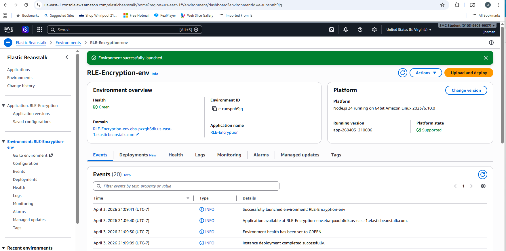
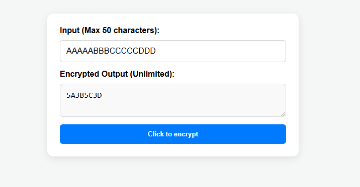
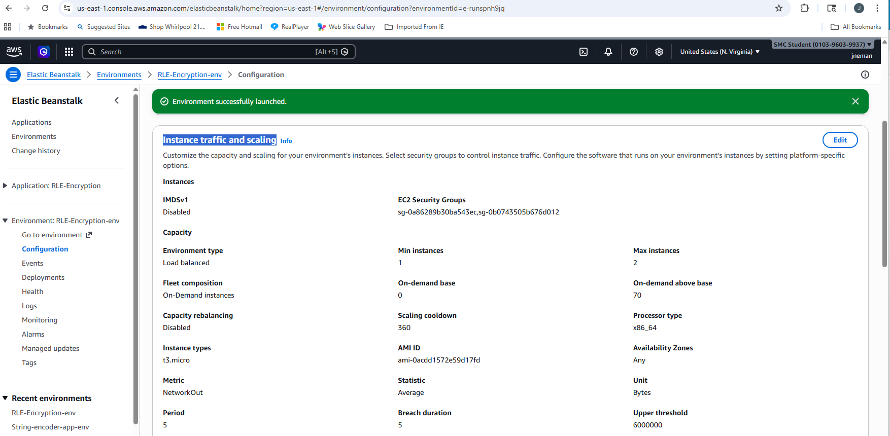
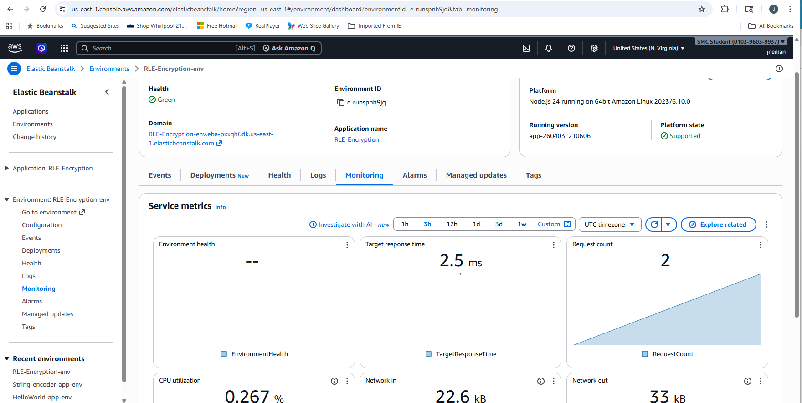
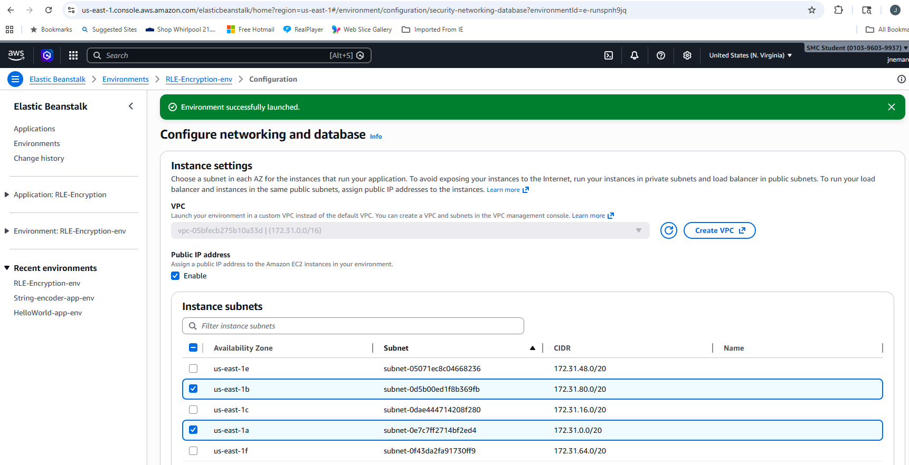
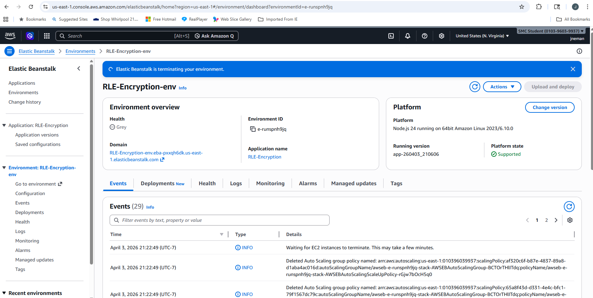
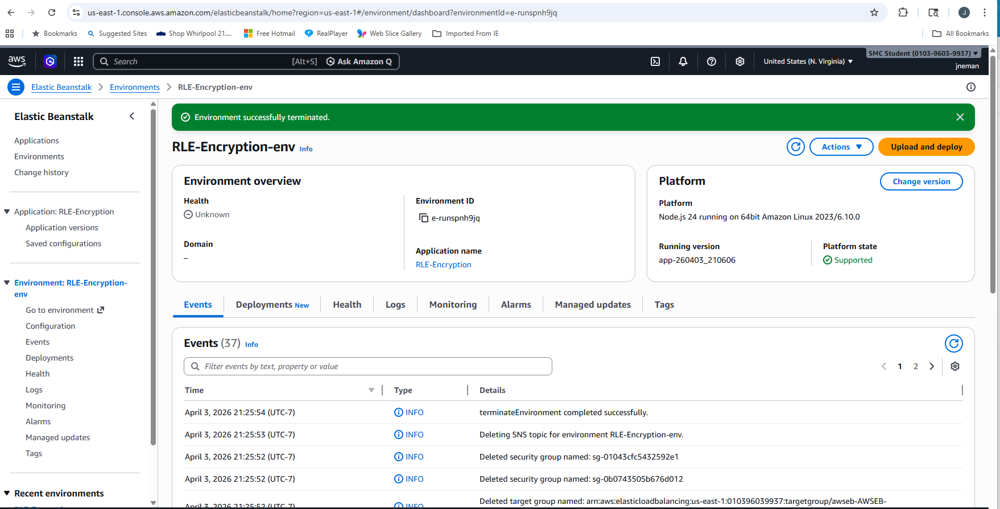

# RLE_Encryption

This project implements **Run-Length Encoding (RLE) encryption** for strings.  
It includes a simple web UI for users to enter text, encrypt it using RLE, and  
# RLE_Encryption

This project implements **Run-Length Encoding (RLE) encryption** for strings.  
It includes a simple web UI for users to enter text, encrypt it using RLE, and  
view the result.  

The backend logic was originally implemented in **Java** and then translated to  
JavaScript for integration with the web UI using AI. The frontend idea was all  
mine, but was coded using AI.  

---

## Features

- Input a string (up to 50 characters) and get its RLE encryption.  
- Handles control characters like Esc or <Ctl>c by ignoring them.  
- Output box scrolls if encrypted text exceeds 50 characters.  
- Web UI hosted on **AWS Elastic Beanstalk**.  
- Health Monitoring for instances via AWS CloudWatch.  

---

## Technology Stack

- Backend: Java → Translated to Node.js using AI  
- Frontend: HTML + JavaScript  
- Web server: Express.js (`app.js`)  
- Deployment: AWS Elastic Beanstalk  

---

## RLE Algorithm

- Example: Input `aaabbc` → Output `3a2b1c`  
- Time Complexity: O(n)  
- Space Complexity: O(n)  

---

## Testing

The application was tested locally with the following scenarios:

1. Normal input: `aaabbc`. Verified output: `3a2b1c`.  
2. Input limited to 50 characters.  
3. Control characters like Esc or <Ctl>c are ignored.  
4. If no input is provided and "Click to Encrypt" is pressed, a message  
   is displayed.  
5. If the input is something like:  
   `abcdefghijklmnopqrstuvwxyzabcdefghijklmnopqrstuvwx`  
   the output textbox becomes scrollable to accommodate the full result.  

---

## Screenshots

1. **Elastic Beanstalk Launch**  
   Shows the Elastic Beanstalk environment after successful launch.  
   


2. **UI Example**  
   Main web interface where users input a string and generate its RLE encryption.  
   


3. **Auto Scaling**  
   Demonstrates scaling with 1–2 EC2 instances.  
   


4. **Monitoring**  
   Shows metrics like instance health and CPU utilization.  
   


5. **Networking**  
   Shows the networking setup across 2 AZs for redundancy.  
   


6. **Terminate Request**  
   Shows request to terminate the environment.  
   


7. **Terminated**  
   Confirms the environment has been successfully terminated.  
   

---

## How to Run Locally

Assuming you have already installed Node.js and cloned the repo, bring up the server:

```bash
node app.js

Using your browser, go to http://localhost:8080
 to test the encryption UI.

Repository: https://github.com/jneman/RLE_Encryption
Project Structure

RLE_Encryption/ ← Repository root
├─ README.md ← Project documentation
├─ index.html ← Frontend HTML file
├─ app.js ← Node.js backend using Express.js
├─ package.json ← Node.js project configuration
├─ package-lock.json ← Lock file for Node.js dependencies
└─ screenshots/ ← Folder containing project screenshots
├─ RLE-Encryption.png
├─ EncryptAString.png
├─ InstanceTrafficAndScaling.png
├─ Monitoring.png
├─ Networking.png
├─ Terminating.png
└─ Terminated.png

To deploy this application to AWS Elastic Beanstalk, follow these steps:
Files to include in nodejs.zip

Include the following files (do not include screenshots/):

index.html
app.js
package.json
package-lock.json
Steps to deploy
Log in to your AWS Management Console.
Go to Elastic Beanstalk → Applications → Create Application.
Application name: RLE_Encryption
Platform: Select Node.js from the dropdown.
Platform branch: Select Node.js 24 running on 64bit Amazon Linux 2023
Application Code: Select Local file, then upload your nodejs.zip file.
Click Create.
Wait a few minutes for the environment to launch.
The environment should show a green health status.
Click on the URL under Domain to open the RLE Encryption UI in your browser.
Notes
For simplicity, following the 10 steps above creates a Single Instance environment
to keep costs low and setup simple.
Monitoring: Use the Elastic Beanstalk dashboard to verify the instance is healthy.

